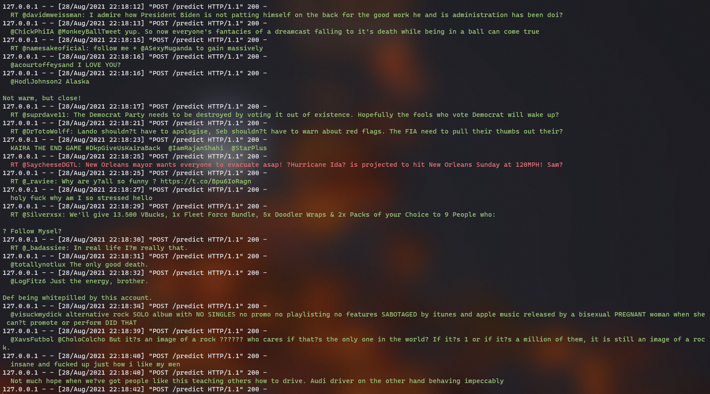
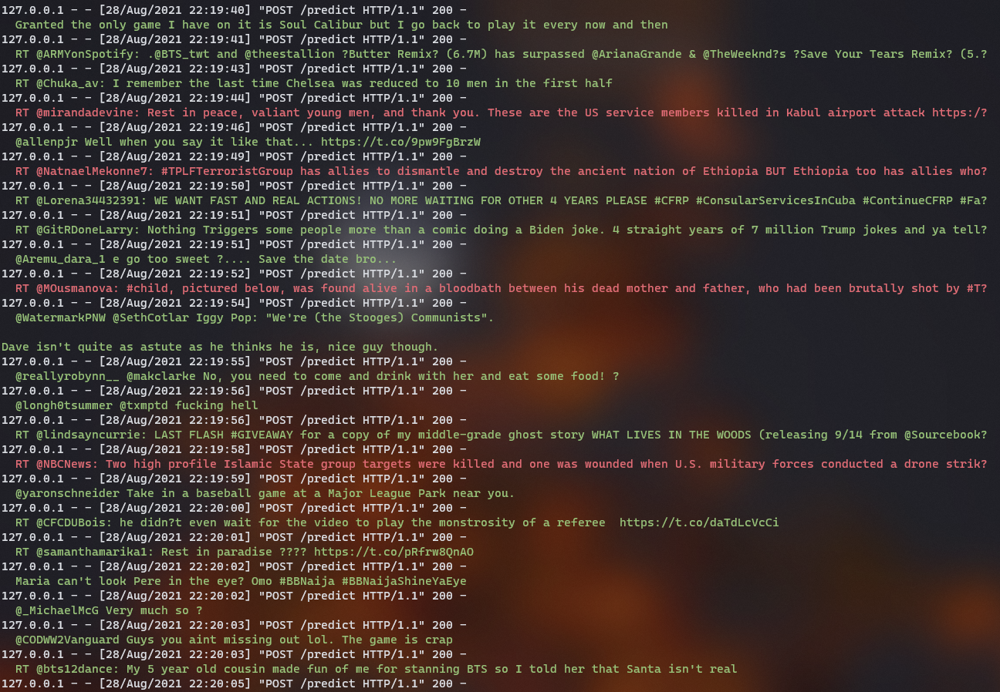

# Disaster Alerting System
 Apache Spark streaming application using Twitter4j and developer account (provides OAuth keys) to stream live tweets and classify them. The model predicts whether a particular tweet is informing about a disaster or not. This way, we can create an efficient Disaster Alerting System, which takes information straight from witnesses.
 
 Using NLP techniques to process tweets and classify them.
 
 [Flair](https://github.com/flairNLP/flair) framework built on PyTorch has been used to train the text classifier.
 GloVe Twitter embeddings stacked with Flair embeddings ('news-forward' and 'news-backward'). The model itself is a GRU (a certain kind of RNN).
 The model has been trained with default hyperparameters, so they are not presented here. My goal wasn't to train the best model, but to build a working infrastructure.
 
 The dataset for training has been taken from [Kaggle](https://www.kaggle.com/c/nlp-getting-started).
 
 Visit [Google Colab](https://colab.research.google.com/drive/1PRDUQZNozu_J5gveSQsIGiTy9XWtMdK_?usp=sharing) to see the training code
 
 Model results on a test dataset (a 1/10 of `train.csv`)
 
 ```
               precision    recall  f1-score   support
 
            1     0.8513    0.6735    0.7521       340
            0     0.7744    0.9050    0.8346       421
 
    micro avg     0.8016    0.8016    0.8016       761
    macro avg     0.8128    0.7893    0.7933       761
 weighted avg     0.8088    0.8016    0.7977       761
  samples avg     0.8016    0.8016    0.8016       761
```
 
 After tuning hyperparameters, paying more attention to text cleaning, maybe changing GRU to BiLSTM, and possible feature engineering, you may get quite better results.
 
 Screenshots from server log:
 
 
 
 
 Green color means the model's prediction is `"not disaster"`, and red - `"disaster"`
 
 ### TODO
 
 - [ ] Docker for the server
 - [ ] GUI 
 
 ## :gear: Requirements and building
 
  ```git
  git clone https://github.com/Goader/disaster-alerting-spark.git
  ```
 
 ### :snake: Python
  
  * Flask 2.0.1
  * Flair 0.8.0.post1
  * Colorama
  
  _To run the server - simply run `server.py` script passing a path to the model `.pt` file as an argument_
 
 ### :oil_drum: Scala
  
 * Scala 2.12.10
 * Apache Spark 3.1.1
 * Apache Bahir (Spark Streaming Twitter) 2.4.0
 * Play JSON Parser 2.9.2
 * Twitter4j 4.0.6
 
 _To run the application - use SBT._
 
 There is 1 App object:
   * `Application` - main application object, which runs the program (make sure the server is running by this time)
 
 ## :keyboard: Created by [@Goader](https://github.com/Goader)
